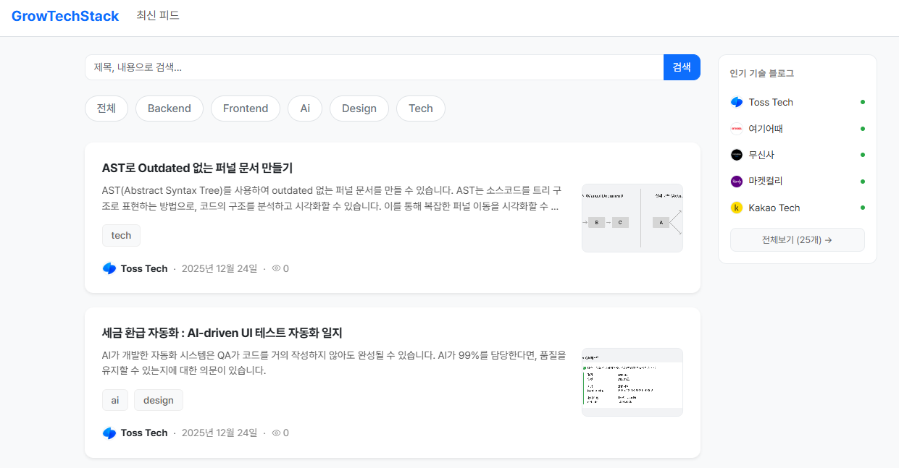

# GrowTechStack (GTS)

> 국내 IT 기업들의 최신 기술 블로그 소식을 한눈에 모아보세요.

<p align="center">
  
</p>

---

## 서비스 소개

GrowTechStack은 국내 주요 IT 기업의 기술 블로그 RSS를 자동 수집하고,
AI 요약을 통해 핵심 내용을 빠르게 파악할 수 있도록 돕는 기술 콘텐츠 플랫폼입니다.

---

## 현재 아키텍처

```
gts-collector-service          gts-ai-summary-service
- RSS 수집 / 저장        →      - Groq(LLaMA 3.1) 기반 AI 요약
- 콘텐츠 API 제공        ←      - 요약 결과 반환
        │                              │
        └──────── Apache Kafka ─────────┘
               content-summary-request →
               ← content-summary-result
```

---

## 레포지토리

| 레포 | 설명 |
|------|------|
| [gts-collector-service](https://github.com/GrowTechStack/gts-collector-service) | RSS 수집, 콘텐츠 저장 및 API 제공 |
| [gts-ai-summary-service](https://github.com/GrowTechStack/gts-ai-summary-service) | Kafka 기반 AI 요약 처리 서비스 |
| [gts-infra](https://github.com/GrowTechStack/gts-infra) | Kafka 등 로컬 개발 인프라 구성 |

---

## 기술 스택

| 분류 | 기술 |
|------|------|
| Backend | Java 17, Spring Boot 3.x, Spring Data JPA |
| Messaging | Apache Kafka (KRaft) |
| AI | Spring AI 1.1.1, Groq (LLaMA 3.1) |
| Database | H2 File (→ MySQL 전환 예정) |
| Frontend | Thymeleaf, Bootstrap 5 (→ React 분리 예정) |
| Infra | Docker, (배포 예정: AWS / OCI) |

---

## 목표 아키텍처 (변경 가능성 있음)

```
  GitHub Actions (CI/CD)          Terraform (IaC)
         │                               │
         │         ┌────────────────────────────────────────────────┐
         │         │                  AWS Cloud                      │
         │         │                                                 │
         └────────▶│                                                 │
                   │   Frontend (React/Next.js)                      │
                   │         │                                        │
                   │         ▼                                        │
  User ───────────▶│   API Gateway (Spring Cloud Gateway)            │
                   │         │     - 라우팅                           │
                   │         │     - JWT 인증 (Redis)                 │
                   │         │     - Rate Limiting                    │
                   │         │                                        │
                   │   ┌─────┼──────────┬──────────┐                 │
                   │   ▼     ▼          ▼          ▼                 │
                   │ collector  ai-summary  auth   (확장)            │
                   │ service    service     service                   │
                   │   │    │       │          │                      │
                   │   │    └──── Kafka ───────┘                     │
                   │   │        (AWS MSK)                             │
                   │   │                                              │
                   │   ├── MySQL (AWS RDS)                           │
                   │   │     └─ collector, auth                      │
                   │   │                                              │
                   │   ├── Redis (AWS ElastiCache)                   │
                   │   │     └─ Gateway (Rate Limit), auth (세션)    │
                   │   │                                              │
                   │   └── Prometheus + Grafana                      │
                   │         └─ 전 서비스 메트릭 수집 / 대시보드      │
                   │                                                  │
                   └──────────────────────────────────────────────────┘
```

### 단계별 계획

| 단계 | 내용 | 상태 |
|------|------|------|
| 1 | RSS 수집 + AI 요약 (Kafka 연동) | ✅ 완료 |
| 2 | MySQL 마이그레이션 + AWS 배포 (Terraform) | 🔲 예정 |
| 3 | Spring Cloud Gateway + Redis 도입 | 🔲 예정 |
| 4 | Auth 서비스 (JWT + Redis 세션) | 🔲 예정 |
| 5 | Prometheus + Grafana 모니터링 | 🔲 예정 |
| 6 | 프론트엔드 분리 (React/Next.js) | 🔲 예정 |
